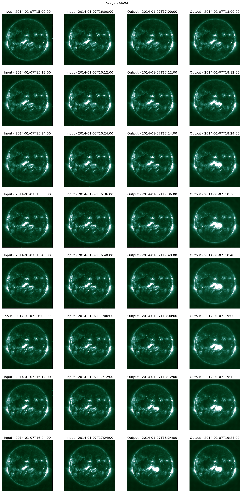

<div align="center">

# ☀️ Surya: Foundation Model for Heliophysics ☀️

[](https://huggingface.co/nasa-ibm-ai4science)
[](https://arxiv.org/abs/2508.14112)
[](https://opensource.org/licenses/Apache-2.0)
   
*The first foundation model for heliophysics trained on full-resolution Solar Dynamics Observatory data*

</div>

<p align="center">
    
</p>


## 📖 Overview

**Surya** (Sanskrit for "Sun") is a 366M-parameter foundation model for heliophysics, trained on full-resolution multi-instrument SDO observations (AIA & HMI). It learns general-purpose solar representations through spatiotemporal transformers, enabling state-of-the-art performance in solar flare forecasting, active region segmentation, solar wind prediction, and EUV spectra modeling.


### Key Features

- **Multi-instrument Learning**: Trained on 13 channels from SDO's AIA (8 channels) and HMI (5 channels) instruments
- **Full Resolution**: Native 4096×4096 pixel resolution with 12-minute cadence
- **Novel Architecture**: Spatiotemporal transformer with spectral gating and long-short range attention
- **Zero-shot Capabilities**: Forecasts solar dynamics and flare events without additional training
- **Versatile Fine-tuning**: Parameter-efficient LoRA adaptation for diverse downstream tasks

### What Makes Surya Special?

Unlike traditional task-specific models, Surya learns physics-aware representations that generalize across multiple solar phenomena:

- **Solar Flare Forecasting**
- **Active Region Segmentation**
- **Solar Wind Prediction**
- **EUV Spectra Modeling**

## 🚀 Quick Start

### Prerequisites

- Python 3.11+
- CUDA-capable GPU (recommended)
- [uv package manager](https://docs.astral.sh/uv/) (recommended)

### 🛠️ Installation

1. **Clone the repository**
```bash
git clone https://github.com/NASA-IMPACT/Surya.git
cd Surya
```

2. **Install uv package manager (optional)**
```bash
curl -LsSf https://astral.sh/uv/install.sh | sh
source ~/.bashrc
```

3. **Set up the environment**
```bash
uv sync
source .venv/bin/activate
```

### 🧪 Verify Installation

Run the end-to-end test to ensure everything is working:

```bash
python -m pytest -s -o log_cli=true tests/test_surya.py
```

This will:
- Download the pretrained model and test data
- Generate 2-hour ahead forecasts for 2014-01-07
- Create a validation visualization (`surya_model_validation.png`)
- Verify model inference

Expected output:
```
============================= test session starts ==============================
INFO     test_surya:test_surya.py:188 GPU detected. Running the test on device 0.
INFO     test_surya:test_surya.py:195 Surya FM: 366.19 M total parameters.
INFO     test_surya:test_surya.py:199 Loaded weights.
INFO     test_surya:test_surya.py:201 Starting inference run.
INFO     test_surya:test_surya.py:215 Completed validation run. Local loss 0.31665.
PASSED                                                    [100%]
```



## 🎯 Downstream Applications

To download the Surya model and a sample dataset for downstream tasks, please follow these steps:

```bash
# Step 1: Run pytest to download the model and verify dependencies
python -m pytest -s -o log_cli=true tests/test_surya.py  

# Step 2: Navigate to the downstream examples
cd downstream_examples/

# Step 3: Download the sample dataset
python download_data.py
```


### 1. Solar Flare Forecasting

Predict M-class and X-class solar flares up to 24 hours in advance.

```bash
cd downstream_examples/solar_flare_forcasting
bash download_data.sh
torchrun --nnodes=1 --nproc_per_node=1 --standalone finetune.py
```

### 2. Active Region Segmentation

Segment solar active regions and polarity inversion lines from magnetograms.

```bash
cd downstream_examples/ar_segmentation  
bash download_data.sh
torchrun --nnodes=1 --nproc_per_node=1 --standalone finetune.py
```

### 3. Solar Wind Forecasting

Predict solar wind speed at L1 point with 4-day lead time.

```bash
cd downstream_examples/solar_wind_forcasting
bash download_data.sh
torchrun --nnodes=1 --nproc_per_node=1 --standalone finetune.py
```

### 4. EUV Spectra Modeling

Model extreme ultraviolet irradiance across 1343 spectral bands (5-35 nm).

```bash
cd downstream_examples/euv_spectra_prediction
bash download_data.sh
torchrun --nnodes=1 --nproc_per_node=1 --standalone finetune.py
```


## 📥 Data and Model Access

### Pretrained Models

The Surya foundation model and datasets are available on HuggingFace 🤗 :

- **Model Repository**: [`nasa-ibm-ai4science/Surya-1.0`](https://huggingface.co/nasa-ibm-ai4science/Surya-1.0)
- **Dataset Repository**: [`nasa-ibm-ai4science/core-sdo`](https://huggingface.co/datasets/nasa-ibm-ai4science/core-sdo)

### SDO Data Download

For downstream applications, download the preprocessed SDO data:

```bash
cd downstream_examples
python download_data.py
```

This will:
1. Download data from HuggingFace repository
2. Extract and organize validation/test datasets  
3. Generate CSV index files for each downstream task
4. Set up data in the expected directory structure


## 📊 Model Architecture

Surya employs a novel spatiotemporal transformer architecture optimized for solar dynamics:

### Core Components

1. **Spectral Gating Blocks** (2 layers)
   - Frequency-domain filtering with learnable complex weights
   - Adaptive re-weighting of spectral components
   - Noise suppression and feature enhancement

2. **Long-Short Attention Blocks** (8 layers) 
   - **Local attention**: Fine-scale dependencies within spatial windows
   - **Global attention**: Long-range correlations via dynamic projection
   - Multi-scale representation learning

3. **Decoder Block**
   - Lightweight projection back to physical domain
   - Maintains spatial structure and channel relationships

### Training Strategy

- **Phase 1**: One-step ahead forecasting (160k steps, 128 GPUs)
- **Phase 2**: Autoregressive rollout tuning (2-5 hour horizons)
- **Objective**: Mean Squared Error with signum-log normalization
- **Data**: 2011-2019 SDO observations (~257TB processed)


### Data Processing Pipeline

Our preprocessing ensures ML-ready, physics-consistent data:

- **Temporal alignment**: 12-minute cadence across all instruments
- **Spatial registration**: Uniform 0.6"/pixel grid, solar north alignment
- **Calibration**: Instrument degradation correction, exposure normalization
- **Quality control**: Automated flagging and filtering

## 🏆 Performance Benchmarks

| Task | Metric | Surya | Baseline | Improvement |
|------|---------|-------|----------|-------------|
| Solar Flare Forecasting | TSS | **0.436** | 0.358 (AlexNet) | 22% |
| Active Region Segmentation | IoU | **0.768** | 0.688 (UNet) | 12% |  
| Solar Wind Prediction | RMSE | **75.92** | 93.76 (ResNet50) | 19% |
| EUV Spectra Modeling | MAPE | **1.48%** | 1.68% (AlexNet) | 12% |

## 📄 Citation

If you use Surya in your research, please cite our paper:

```bibtex
@article{roy2025surya,
  title={Surya: Foundation Model for Heliophysics},
  author={Roy, Sujit and Schmude, Johannes and Lal, Rohit and Gaur, Vishal and Freitag, Marcus and Kuehnert, Julian and van Kessel, Theodore and Hegde, Dinesha V and Mu{\~n}oz-Jaramillo, Andr{\'e}s and Jakubik, Johannes and others},
  journal={arXiv preprint arXiv:2508.14112},
  year={2025}
}
```

## 📜 License

This project is licensed under the Apache License 2.0. See the [LICENSE](LICENSE) file for details.

## 🤝 Contributing

We welcome contributions to the Surya repository! Please see our contribution guidelines and feel free to:

- 🐛 Report bugs and issues
- 💡 Suggest new features or applications
- 🔧 Submit pull requests for improvements
- 📖 Improve documentation and examples
