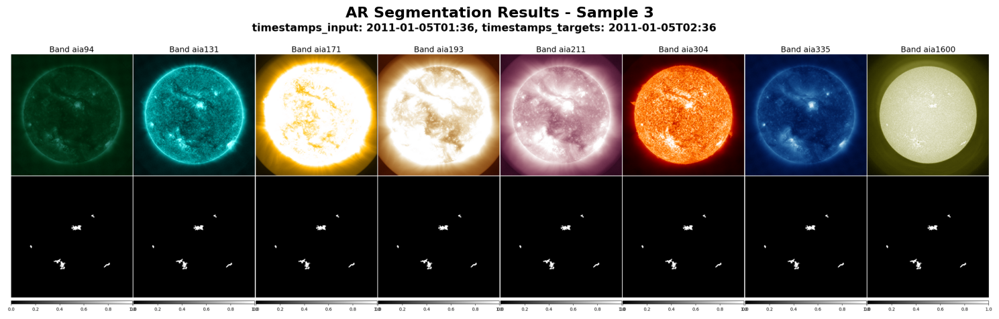

# Active Region Segmentation

A fine-tuning example for solar Active Region (AR) segmentation using the Surya foundation model. This project demonstrates how to adapt Surya for downstream computer vision tasks on solar imagery.


## Requirements

### System Requirements
- Python 3.8+
- CUDA-capable GPU (recommended)
- 50GB+ free disk space for dataset
- Hugging Face account for data access


## Setup and Data Download

```bash
cd downstream_examples/ar_segmentation

# Download AR segmentation dataset (requires Hugging Face login)
bash download_data.sh

# Create CSV indices for training data
python create_ar_csv.py

# unzip masks stored in data.tar.gz in data
cd assets/surya-bench-ar-segmentation
mkdir -p data
tar -xvzf data.tar.gz -C data
```

## Training

```bash
cd downstream_examples/ar_segmentation
# Single GPU training
torchrun --nnodes=1 --nproc_per_node=1 --standalone finetune.py

# Multi-GPU training (example for 4 GPUs)
torchrun --nnodes=1 --nproc_per_node=4 --standalone finetune.py
```

## Inference

Run Active Region segmentation inference using either the interactive notebook or command-line scripts.
**Prerequisites**: Download all the data using the [download_data.sh](download_data.sh) script.

### Option A: Interactive Notebook (Recommended for beginners)

The [ar_segmentation_tutorial.ipynb](ar_segmentation_tutorial.ipynb) notebook provides step-by-step guidance with visualizations.

### Option B: Command-Line Inference

**Basic GPU Inference**
```bash
python infer.py --checkpoint_path ./assets/ar_segmentation_weights.pth \
                --output_dir ./inference_results \
                --num_samples 3 \
                --device cuda 
```

**CPU Inference** (slower but no GPU required)
```bash
python infer.py --checkpoint_path ./assets/ar_segmentation_weights.pth \
                --output_dir ./inference_results \
                --num_samples 3 \
                --device cpu
```

**Advanced Usage**
```bash
# Custom configuration and more samples
python infer.py --config_path ./config.yaml \
                --checkpoint_path ./assets/ar_segmentation_weights.pth \
                --output_dir ./custom_results \
                --num_samples 10 \
                --data_type valid \
                --device cuda
```

### Parameters Reference
| Parameter | Default | Description |
|-----------|---------|-------------|
| `--config_path` | `./config.yaml` | Path to model configuration file |
| `--checkpoint_path` | `./assets/ar_segmentation_weights.pth` | Path to trained model weights |
| `--output_dir` | `./inference_results` | Directory for saving results |
| `--num_samples` | `3` | Number of samples to process and visualize |
| `--data_type` | `test` | Dataset split to use (`test` or `valid`) |
| `--device` | `cuda` | Computing device (`cuda` or `cpu`) |

#### Output
- **Visualizations**: Multi-panel images showing input channels, predictions, and ground truth
- **Format**: High-resolution PNG files
- **Naming**: `test_0.png`, `test_1.png`, etc.
- **Location**: Specified `output_dir`


The output 
## Dataset Information

### Input Data
- **Format**: SDO/AIA multi-channel solar images
- **Shape**: (13, 4096, 4096) - 13 channels including:
  - AIA channels: 94Å, 131Å, 171Å, 193Å, 211Å, 304Å, 335Å, 1600Å
  - HMI channels: Magnetogram, Bx, By, Bz, Velocity
- **Temporal coverage**: 2011-2014
- **Cadence**: 12-minute intervals

### Output Data
- **Format**: Binary segmentation masks
- **Shape**: (4096, 4096)
- **Classes**: Background (0) and Active Region (1)

### Data Source
The dataset is hosted on Hugging Face: [nasa-ibm-ai4science/surya-bench-ar-segmentation](https://huggingface.co/datasets/nasa-ibm-ai4science/surya-bench-ar-segmentation)
For more details on mask creation methodology, see [SuryaBench AR Segmentation](https://github.com/NASA-IMPACT/SuryaBench/tree/main/ar_segmentation).

## File Structure

```
ar_segmentation/
├── README.md                    # This file
├── config.yaml                  # Training configuration
├── download_data.sh            # Data download script
├── create_ar_csv.py            # Dataset indexing script
├── finetune.py                 # Training script
├── infer.py                    # Inference script
├── run_inference_example.sh    # Inference example
├── dataset.py                  # Dataset class implementation
├── models.py                   # Model definitions
└── assets/                     # Data indices and downloaded data
```

## Pre-trained Models

Pre-trained weights are available on Hugging Face:
- **Repository**: [models/nasa-ibm-ai4science/ar_segmentation_surya](https://huggingface.co/nasa-ibm-ai4science/ar_segmentation_surya)
- **Model Type**: SpectFormer with LoRA adapters

### Custom Dataset
To use your own AR masks:

1. Organize masks in the expected directory structure
2. Update the CSV files with your data paths
3. Modify `config.yaml` to point to your indices
